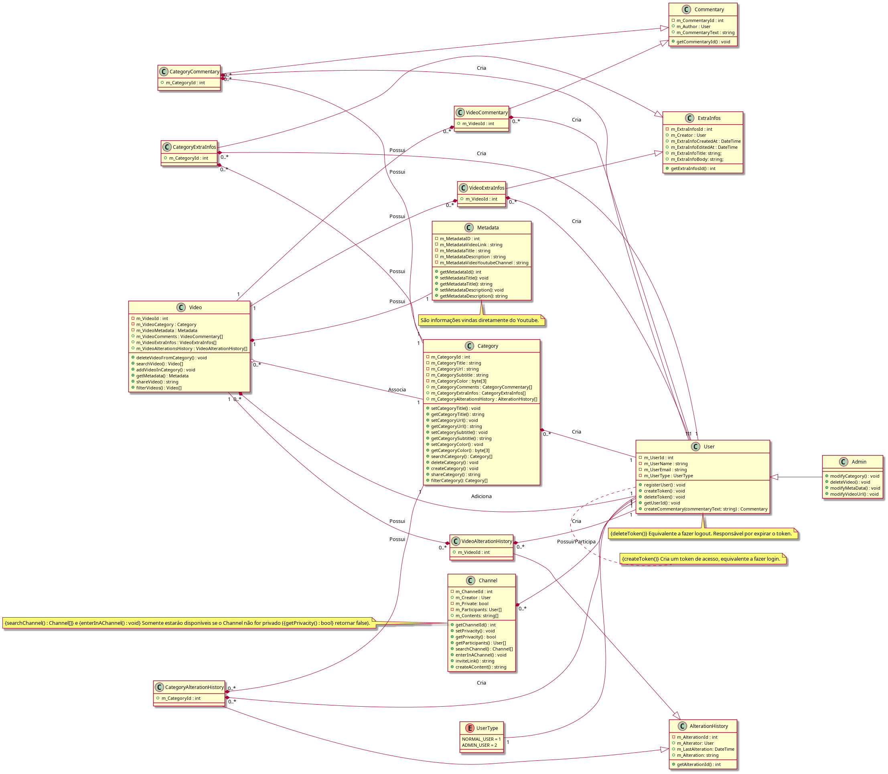
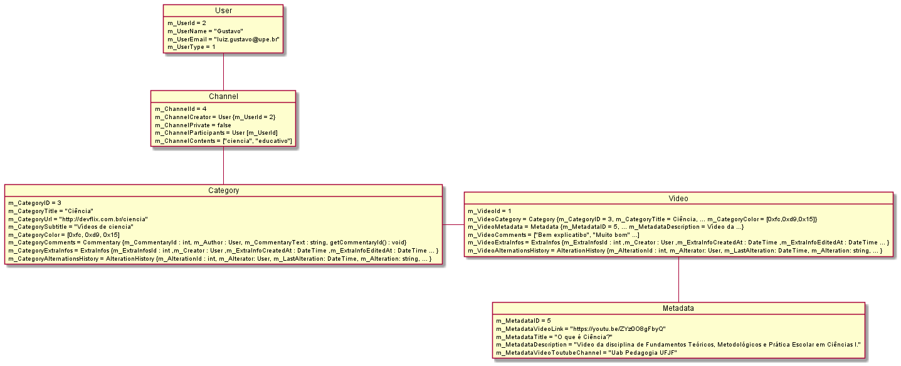

   

	
  

  
  
   
   

> 📺 **DevFlix** é um _breve descrição_.

    <a href="README-pt.md">Português</a>

  O projeto DevFlix. Foi projetado com ❤︎ por
    <a href="https://github.com/tonicprism">Luiz Gustavo</a>
    <a href="https://github.com/MurylloEx">Muryllo Pimenta</a>
    <a href="https://github.com/#">Kelvin Vasconcelos</a>
    <a href="https://github.com/#">Lucas Henrique</a>
  

# 📸 Diagramas

   <h2>Diagrama de classe</h2>
   

   <h2>Diagrama de objeto</h2>
   

   <h2>Diagrama de pacotes</h2>

   

   <h2>Diagrama de caso de uso</h2>

   

# :computer: Tecnologias

Este projeto foi feito utilizando as seguintes tecnologias:

- [UML](https://www.uml.org/)
- [PlantUML](https://plantuml.com/)
- [Astah](https://astah.net/)
- [Lucidcharts](https://lucid.app/documents)

# ✌ Feito com ❤︎ por [Luiz Gustavo](https://github.com/#), [Lucas Henrique](https://github.com/#), [Muryllo Pimenta](https://github.com/MurylloEx/), [Kelvin Vasconcelos](https://github.com/#)

Deixe uma ⭐️ se este projeto ajudou você!
